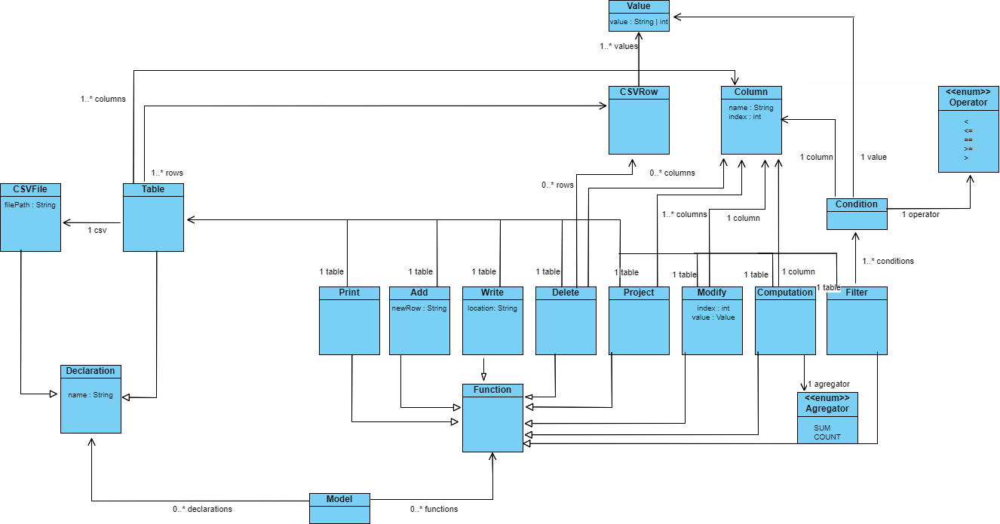
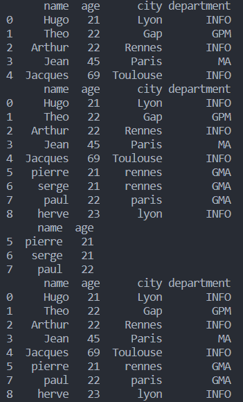

# DSL Project for CSV File Processing

## Overview

The Thorium DSL Compiler project focuses on developing a specialized Domain Specific Language (DSL) tailored for efficient operations on CSV files. Inspired by the functionalities of Python Pandas and R, Thorium aims to streamline and simplify complex data manipulations commonly encountered in data analysis. The project involves the creation of a compiler that seamlessly translates Thorium scripts into Python or R code, optimizing execution for enhanced performance. Thorium's rich set of functions mirrors those of Python Pandas and R, providing users with a unified and familiar environment for data processing. Ultimately, this project seeks to empower data analysts by bridging the gap between Python and R, fostering collaboration and standardizing CSV data manipulation practices in the realm of data science.

## Supported Libraries and Languages

This project supports the following languages:

- R
- Python (Pandas)

The necessary libraries for each language are specified in the respective documentation.

## Abstract Syntax



The DSL defines an abstract syntax that allows for an intuitive description of CSV file manipulation operations. Each line in the program is either a declaration (csv file and table using a file) or a function that manipulates a table. A table has several rows/columns that contains all of our data. All the functions allow us to process the data and collect/print it.

## Programs in Action

Explore the included program examples in the `examples/` directory to witness the DSL in action. These programs demonstrate various features such as CSV file reading, transformation operations, and compilation to R or Pandas.

Here is an example of how we can handle csv manipulation in our language, Thorium.

```let csv = CSVFile("data.csv")
let table = Table(csv)

table.print()
table.add("pierre, 21, rennes,GMA")
table.add(["serge,21,rennes,GMA", "paul, 22, paris,GMA", "herve, 23, lyon,INFO"])
table.print()

let table2 = table
table2.filter("department" == "GMA")
table2.project(["name","age"])
table2.print()

table.modify(2,4,"GPM")
table.delete(7)
table.print()
table.write("data2.csv")
```

Here, we use Thorium to read a csv file and put its data in a table object. We then print the table in the console at each important step of the manipulation.
First, we add a row to the table, and then an array of rows, because there has been some new arrivals at INSA.
Then we create a view of the table by copying it, and we're filtering and projecting it to see only the names and ages of the GMA department's students.
As we saw in the created view that there were errors about some students in GMA department. One of them changed department, and the other left. Hence, we decide to change the csv file according to that. We write every change we've made in the csv file. Here are the results :



## How to Run the Project

To run the project, follow these simple steps:

1. Clone the repository to your local machine.
2. Write `npm i` to install all the necessary dependencies to start the project.
3. Use `npm start` to kick-off the project and generate the AST of the language.

Then you can choose between different commands to perform various actions :

- `npm run compile --file=./test-cases/testAdd.th3` to compile a specific test program. Just replace the path of the program you want to compile. Use of the `--file` option is mandatory.
- `npm test` to run all the tests of the language and verify everything is running well. It also runs a benchmark between the compilers to see which compiler performs best for a specific task or the default ones included in the project (R may be better at performing some tasks than Pandas).

## Assessment of Different Compilers

The project evaluates various compilers for code generation, including R and Python. Refer to the following benchmark for details on the performance and features of each compiler :

| Function    | Language | Time Execution | Memory Consumption |
| ----------- | -------- | -------------- | ------------------ |
| Write       | Python   | 606.03 ms      | 32.11 MB           |
|             | R        | 295.36 ms      | 32.20 MB           |
| Add         | Python   | 593.49 ms      | 32.06 MB           |
|             | R        | 281.29 ms      | 32.16 MB           |
| Computation | Python   | 610.44 ms      | 34.35 MB           |
|             | R        | 249.89 ms      | 34.44 MB           |
| Project-1   | Python   | 660.29 ms      | 31.65 MB           |
|             | R        | 218.09 ms      | 31.74 MB           |
| Project-2   | Python   | 691.37 ms      | 32.31 MB           |
|             | R        | 228.99 ms      | 32.40 MB           |
| Filter-1    | Python   | 689.85 ms      | 34.71 MB           |
|             | R        | 235.54 ms      | 34.80 MB           |
| Filter-2    | Python   | 647.37 ms      | 35.45 MB           |
|             | R        | 238.38 ms      | 35.54 MB           |
| Modif-1     | Python   | 729.68 ms      | 29.62 MB           |
|             | R        | 196.50 ms      | 29.72 MB           |
| Modif-2     | Python   | 729.68 ms      | 29.62 MB           |
|             | R        | 196.50 ms      | 29.72 MB           |
| Modif-3     | Python   | 596.77 ms      | 30.29 MB           |
|             | R        | 246.63 ms      | 30.38 MB           |
| Delete-1    | Python   | 539.43 ms      | 34.41 MB           |
|             | R        | 228.49 ms      | 34.51 MB           |
| Delete-2    | Python   | 721.51 ms      | 35.07 MB           |
|             | R        | 251.72 ms      | 35.17 MB           |
| Delete-3    | Python   | 651.08 ms      | 27.64 MB           |
|             | R        | 207.74 ms      | 27.74 MB           |
| Delete-4    | Python   | 603.70 ms      | 28.56 MB           |
|             | R        | 255.79 ms      | 28.65 MB           |

## Langium

This project uses Langium as the framework for creating domain-specific languages. Langium provides a powerful and extensible solution for DSL development.

We found that using Langium was a really interesting way to create a DSL. The presence of Typescript and the yo command to generate a clean folder structure and base project makes it beginner-friendly as all the members already had an experience with npm and Typescript. Comparing it to the previous experiences some of the members could have had with the DSL creation, it is much more simple, as most of the work is already done. It allows to put more focus on developing interesting model and grammar, and on making the language more reliable with test suits and deployment process.
Yet, the default Typescript configuration is sometimes a bit strict. Moreover, it often take way too much time to reload the project when modifying the grammar, particularly when writing tests and an implementation lacks something. Also, as it is still an ongoing project, the framework documentation can be incomplete,limited or not up-to-date at times, which makes it more difficult to solve a problem. For example, we found a problem that was solved in one of the earlier versions, and we really struggled to find that information.

Apart from that, we think that our usecase didn't make us use all of its possibilities such as the web part (editor or generator). And we didn't customize the CLI part, so we can't give any opinion about that part either.

To conclude, Langium is a really powerful tool to create domain specific languages that makes it much easier than what could be done with other tools until now. As there still are a lot of improvements that could be made, we're eager to see how it will evolve in the future.

## Usage of LLM in the Project

We tested and used different LLM to achieve this project. We mainly tried ChatGPT, Github Copilot,Bard and BingChat. We tried BingChat mainly because it's based on GPT-4 whereas this ChatGPT feature was only allowed to premium users but we didn't like the user experience.

First, we didn't ask ChatGPT to generate our grammar or our metamodel because of its lack of knowledge about the Langium framework. It couldn't help us with the writing the .langium file, but it gave us some insights about what is usually included in the metamodel.
Then, we obviously could use it to generate Python and R files that performed simple actions on CSV files as it's a pretty standard question. It was also helpful when it came to generate test files, even if it wasn't always correct or sometimes was OS-dependent. Especially, validation tests were straightforward. To test the output of our Python files, it was more difficult. It required more context, and we found it was most of the time longer to write a prompt than to code the test. But Github Copilot did help with basic syntax in Typescript syntax, or added fluidity to the coding workflow.

All of it, really sped up the development process of our DSL, because usually simple and repetitive tasks that implied basic programmation skills could be handled with a simple prompt and sometimes a few correction steps.
